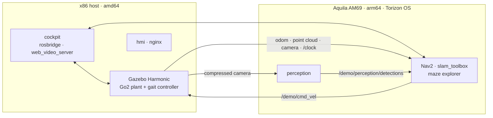

# Aquila AM69 ROS 2 Navigation Demo

A ROS 2 Jazzy reference demo for the **Toradex Aquila AM69** running
**Torizon OS**. A simulated Unitree Go2 quadruped maps an unknown maze with
SLAM and explores it autonomously with Nav2. The simulation runs on an x86
workstation. Navigation and perception run in arm64 containers on the module,
connected to the simulator over Ethernet (hardware in the loop).


## Highlights

- **Hardware in the loop.** Nav2, `slam_toolbox`, the maze explorer and
  perception run on the Aquila AM69. Gazebo Harmonic replaces the physical
  robot on the host, and a real robot driver would only replace the host side.
- **Containerized per role.** One image per responsibility (`sim`, `nav`,
  `perception`, `viz`, `cockpit`, `hmi`), multi-arch. One Compose file per
  machine, and arm64 images are built natively on the module.
- **Legged navigation.** Nav2 with the MPPI controller on a `ros2_control` gait
  controller, a rectangular footprint, and frontier exploration with
  breadcrumb backtracking and AprilTag exit detection.
- **Swappable perception.** A fixed topic contract means a TIDL inference
  container can replace the perception stub without any interface change.
- **Web cockpit.** Live map, costmap, plan, camera streams, detections and
  module telemetry in the browser. No build step and no npm dependencies.
- **Contract-tested.** More than 280 static tests guard the invariants of the
  Compose files, launch files and parameters, and 180 unit tests cover the
  cockpit.

## Architecture



Gazebo and RViz2 never run on the module. The AM69 GPU exposes OpenGL ES 3.2
and Vulkan 1.2, not desktop OpenGL. DDS is CycloneDDS with unicast peers.
Details are in [docs/architecture.md](docs/architecture.md).

| Mode | Host | Aquila AM69 |
| --- | --- | --- |
| `learn` | everything | — |
| `hil` | simulation, RViz2, cockpit | navigation, perception |
| `deploy` | — | navigation, perception, robot driver (not implemented) |

## Requirements

| Machine | Requirement |
| --- | --- |
| Host | Ubuntu 24.04 x86_64, Docker with Compose v2 and buildx, desktop OpenGL GPU, X11 |
| Module | Toradex Aquila AM69 V1.0A with Torizon OS 7.7.0, installed with Toradex Easy Installer |
| Assets | The maze mesh from [`cafemesa/ros_maze_worlds`](https://github.com/cafemesa/ros_maze_worlds) (not vendored) |

> Install Torizon OS on the module only with Toradex Easy Installer. Do not
> use an OTA update to reach this baseline: a V1.0 module with the old
> bootloader does not boot the V1.1 device tree.

## Quick start (single workstation)

```bash
git clone https://github.com/cafemesa/ros_maze_worlds.git ~/ros_maze_worlds
cp docker/.env.example docker/.env      # set MAZE_MODELS and RENDER_GID
scripts/module.sh render-local
xhost +local:docker

BUILDX_BUILDER=default docker compose -f docker/compose.host.yml build base
BUILDX_BUILDER=default docker compose -f docker/compose.host.yml --profile learn build
docker compose -f docker/compose.host.yml --profile learn up -d sim nav perception cockpit hmi
```

Open <http://localhost:8081> and start the exploration from the navigation
panel. To move navigation and perception to the module:

```bash
scripts/module.sh sync && scripts/module.sh build
docker compose -f docker/compose.host.yml up -d sim cockpit hmi
scripts/module.sh up && scripts/module.sh verify
```

The step-by-step guides are [Getting started](docs/getting-started.md),
[HIL deployment](docs/hil-deployment.md) and [Running the demo](docs/running-the-demo.md).

## Project status

The current release is a **supervised navigation-and-exploration demo**. The
robot walks, maps and explores the maze autonomously, with Nav2 and perception
running on the Aquila AM69 and the loop operated from the cockpit. The
following are **not yet demonstrated**:

- a fully autonomous maze escape;
- a sustained thermal characterization;
- a kiosk HMI on the module display;
- inference on the AM69 accelerators.

All hardware results use a simulated robot. Measured figures and the pending
items are listed in [docs/validation.md](docs/validation.md).

## Repository layout

```text
docker/        Dockerfiles, Compose files (host, module), CycloneDDS templates
docs/          Guides, architecture, validation status, decision records
hmi/           Web cockpit (static HTML, CSS and ES modules)
ros2_ws/src/   ROS 2 packages: demo_* (this project) and vendored Go2 packages
scripts/       env.sh, module.sh (module deployment), run_quadruped_sim.sh
tests/         Repository contract tests (plain Python, no ROS needed)
tools/         Evaluation recorders, diagnostics, offline maze analysis
```

## Documentation

Start at the [documentation index](docs/README.md). Key entries:
[architecture](docs/architecture.md), [configuration](docs/configuration.md),
[web cockpit](docs/cockpit.md), [scenarios](docs/scenarios.md),
[troubleshooting](docs/troubleshooting.md), [development](docs/development.md),
and the [architecture decision records](docs/decisions/README.md).

## Testing

```bash
python3 -m pytest tests -q                         # contract tests, no ROS needed
(cd hmi && node --test "test/**/*.test.js")        # cockpit unit tests
(cd ros2_ws && colcon test && colcon test-result --verbose)   # package tests, needs Jazzy
```

## Contributing

See [CONTRIBUTING.md](CONTRIBUTING.md).

## License

This project is licensed under the [Apache License 2.0](LICENSE). Vendored
third-party packages keep their own licenses (BSD-3-Clause and Apache-2.0).
See [NOTICE](NOTICE) for attributions and trademarks.
