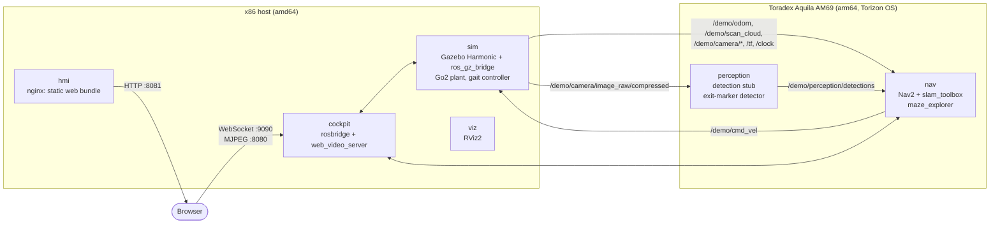

# Architecture

## System context

The demo splits a robotics application across two machines, the way it would
be split with real hardware:

- **x86 host workstation.** It runs the robot's *plant*: a Unitree Go2 quadruped
  simulated in Gazebo Harmonic, plus operator tools (RViz2 and the web cockpit
  backend).
- **Toradex Aquila AM69.** It runs the robot's *brain*: Nav2, SLAM, the maze
  explorer and perception, in arm64 containers on Torizon OS.

The two machines exchange standard ROS 2 topics over DDS (CycloneDDS) on a
wired Ethernet link. Replacing the simulated plant with a real robot driver
only replaces the host side; the module side stays the same.



## Operating modes

The same source tree and the same images support three modes. Only
`platform:` and the machine that starts each service differ.

| Mode | Host | Module | Purpose |
| --- | --- | --- | --- |
| `learn` | `sim`, `nav`, `perception`, `viz`, `cockpit`, `hmi` (all amd64) | — | Development and learning on one workstation |
| `hil` | `sim`, `viz`, `cockpit`, `hmi` | `nav`, `perception` (arm64) | Hardware-in-the-loop: the reference configuration of this demo |
| `deploy` | — | `nav`, `perception`, future `hw` driver | Real robot; not implemented (see [`docker/hw/`](../docker/hw/README.md)) |

Compose files are split **by machine**, not by mode
([ADR 0003](decisions/0003-compose-split-by-machine.md)):

- [`docker/compose.host.yml`](../docker/compose.host.yml) runs on the x86 host.
  The `learn` profile adds `nav` and `perception`.
- [`docker/compose.module.yml`](../docker/compose.module.yml) runs on the
  Aquila AM69 and is driven from the host by
  [`scripts/module.sh`](../scripts/module.sh).

## Containers

Each container has one responsibility. Each role image is built `FROM` a
shared base image (`demo-aquila-base`), which fixes the ROS distribution, the
RMW and the domain ID.

| Service | Runs on | Entry point | Responsibility |
| --- | --- | --- | --- |
| `sim` | host only | `demo_bringup/sim.launch.py` | Gazebo world, robot spawn, `ros2_control` gait controller, ROS–Gazebo bridge, scene cameras, simulation-control façade, camera compression |
| `nav` | module (host in `learn`) | `demo_bringup/nav_select.launch.py` | Nav2 (composed into a single container), `slam_toolbox`, `maze_explorer`, SI-to-gait velocity adapter, odometry TF, target telemetry |
| `perception` | module (host in `learn`) | `demo_bringup/perception.launch.py` | Camera decompression, detection stub, exit-marker detector, detections-to-point-cloud adapter for the costmap |
| `viz` | host only | `demo_bringup/viz.launch.py` | RViz2 |
| `cockpit` | host | `demo_bringup/cockpit.launch.py` | `rosbridge_server`, `rosapi`, `web_video_server` |
| `hmi` | host | nginx | Serves the static cockpit bundle in [`hmi/`](../hmi/README.md) |
| `tools` | both (profile `tools`) | `sleep infinity` | Interactive shell with the ROS CLI, used for diagnostics and evaluation recorders |
| `base` | build only | — | Build-order anchor for the shared base image |

Image names follow `${REGISTRY:-local}/demo-aquila-<service>:${TAG:-dev}`. All
services use host networking.

## Hard constraints

These rules come from the hardware. Breaking any of them costs days.

1. **No desktop OpenGL on the module.** The AM69 GPU exposes OpenGL ES 3.2 and
   Vulkan 1.2 only. Gazebo, RViz2 and anything else built on OGRE 2 stay on the
   host. Module image builds fail if a rendering library is found in the
   image ([ADR 0002](decisions/0002-simulator-stays-on-host.md)).
2. **CycloneDDS only.** `rmw_cyclonedds_cpp` is baked into the base image and
   never changed at runtime ([ADR 0001](decisions/0001-cyclonedds-rmw.md)).
3. **Torizon OS is installed with Toradex Easy Installer only.** The baseline
   is Torizon OS 7.7.0 on Aquila AM69 V1.0A. Do not use an OTA update to reach
   this baseline: a V1.0 module with the old bootloader loads the V1.1 device
   tree and stops booting.
4. **Emulation does not measure performance.** arm64 images may be built under
   QEMU. CPU, latency, thermal and FPS figures only count when measured on the
   module.

## Topic contract

The contract lets perception be replaced (for example by TIDL inference on the
AM69 accelerators) without changing any interface
([ADR 0005](decisions/0005-perception-topic-contract.md)).

| Topic | Type | Producer | Consumers |
| --- | --- | --- | --- |
| `/demo/camera/image_raw` | `sensor_msgs/Image` | Gazebo (or a USB camera or a rosbag) | `demo_perception`, cockpit |
| `/demo/perception/detections` | `vision_msgs/Detection2DArray` | `demo_perception` | Nav2 costmap layer (through `detections_to_cloud`), cockpit |
| `/demo/cmd_vel` | `geometry_msgs/Twist` | Nav2 (through `cmd_vel_si_to_stick`) | Gazebo gait adapter or a real driver |

`demo_perception` never knows where an image comes from. No consumer knows
whether detections come from the stub or from real inference.

### Other interfaces

| Name | Type | Direction | Purpose |
| --- | --- | --- | --- |
| `/demo/odom` | `nav_msgs/Odometry` | sim → nav | Robot odometry |
| `/demo/scan_cloud` | `sensor_msgs/PointCloud2` | sim → nav | Lidar point cloud (flattened to `/demo/scan_slam` for SLAM by `pointcloud_to_laserscan`) |
| `/demo/camera/image_raw/compressed` | `sensor_msgs/CompressedImage` | sim → perception | Camera stream sent across the link ([ADR 0010](decisions/0010-compressed-camera-transport.md)) |
| `/clock` | `rosgraph_msgs/Clock` | sim → all | Simulation time. Note that it is **not** under `/demo` |
| `/map` | `nav_msgs/OccupancyGrid` | `slam_toolbox` | Live SLAM map |
| `/demo/exploration/{start,cancel}` | `std_srvs/Trigger` | cockpit → nav | Start or stop autonomous exploration |
| `/demo/exploration/status` | `std_msgs/String` | nav → cockpit | Explorer state |
| `/demo/nav/reset` | `std_srvs/Trigger` | cockpit → nav | Cancel the goal and clear the costmaps |
| `/demo/sim/{play,pause,reset}` | `std_srvs/Trigger` | cockpit → sim | Simulation control façade ([ADR 0007](decisions/0007-std-srvs-simulation-facade.md)) |
| `/demo/maze/escaped` | `std_msgs/Bool` | sim → cockpit | Escape validator, computed on the simulation side from odometry and independent of the explorer |
| `/demo/target/status` | `std_msgs/String` | nav → cockpit | Module CPU, temperature and memory |
| `/demo/system/heartbeat` | `std_msgs/String` | module → host | Minimal DDS reachability check used by `module.sh verify` |

All project topics are absolute names under `/demo/`. `ROS_NAMESPACE` is not
used: it has no effect on ROS 2 Jazzy.

## TF tree (quadruped)

```text
map ──(odom_tf, identity)──> odom ──(odom_tf)──> base ──(robot_state_publisher)──> links and sensors
```

The Go2 model's root link is `base`, not `base_link`. The quadruped stack runs
without a static map and without AMCL: `slam_toolbox` builds the map live, and
the maze explorer plans on it.

## Data flow of the maze demo

1. `sim` publishes odometry, the lidar point cloud, the camera stream and
   `/clock`.
2. On the module, `slam_toolbox` builds `/map`. `maze_explorer` picks frontier
   goals on it and sends them to Nav2 as `NavigateToPose` goals.
3. The Nav2 MPPI controller outputs `/demo/cmd_vel_si`. `cmd_vel_si_to_stick`
   rescales it to the gait controller's stick convention on `/demo/cmd_vel`.
4. On the host, `twist_to_inputs` converts the command into gait inputs for
   the `unitree_guide_controller`, which drives the legs in Gazebo.
5. In parallel, `maze_exit_detector` looks for the AprilTag at the maze exit.
   When the tag is confirmed, the explorer switches to homing towards it.
6. `maze_escape_validator` independently reports on `/demo/maze/escaped` when
   the robot leaves the maze.

## Repository layout

```text
.
├── docker/            Dockerfiles, Compose files (per machine), CycloneDDS templates
├── docs/              Documentation (you are here)
├── hmi/               Web cockpit: static HTML/CSS/ES modules, no build step
├── ros2_ws/src/       ROS 2 packages (demo_* are this project's, the rest are vendored)
├── scripts/           Operational scripts: environment, module deployment, native simulator
├── tests/             Repository-level contract tests (no ROS needed)
└── tools/             Evaluation recorders, diagnostics and offline maze analysis
```

| Package | Kind | Role |
| --- | --- | --- |
| [`demo_bringup`](../ros2_ws/src/demo_bringup/README.md) | own | One launch file per container role, adapter nodes |
| [`demo_simulation`](../ros2_ws/src/demo_simulation/README.md) | own | Worlds, spawn, bridge, gait adapter, simulation-control façades |
| [`demo_navigation`](../ros2_ws/src/demo_navigation/README.md) | own | Nav2 parameters, SLAM, maze explorer, navigation reset façade |
| [`demo_perception`](../ros2_ws/src/demo_perception/README.md) | own | Detection stub, exit-marker detector, costmap adapter |
| [`demo_description`](../ros2_ws/src/demo_description/README.md) | own | Differential-drive fallback robot description |
| [`demo_tutorials`](../ros2_ws/src/demo_tutorials/README.md) | own | Minimal pub/sub/service examples and DDS heartbeat |
| [`go2_description`](../ros2_ws/src/go2_description/README.md) | vendored | Unitree Go2 URDF and meshes |
| [`unitree_guide_controller`](../ros2_ws/src/unitree_guide_controller/README.md), `controller_common`, `control_input_msgs` | vendored | `ros2_control` gait controller |
| [`gz_quadruped_hardware`](../ros2_ws/src/gz_quadruped_hardware/README.md) | vendored | `ros2_control` system interface inside Gazebo |

The differential-drive robot (`ROBOT_TYPE=diffdrive`, TurtleBot 4 based, in a
warehouse world with a static map and AMCL) is kept as a tested fallback. It
uses the same containers and the same topic contract.
