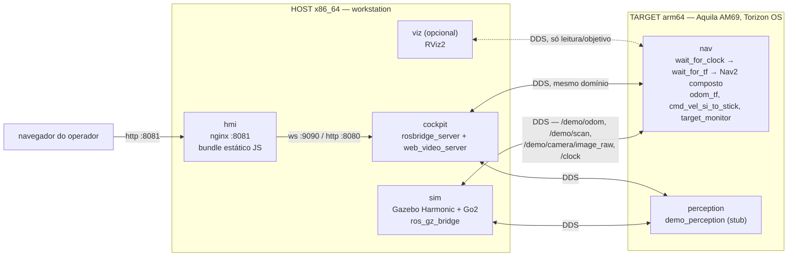

# HIL — Go2 no labirinto (cockpit no host, ROS no Aquila AM69)

Guia enxuto para **uma única configuração**: modo `hil`, robô quadrúpede
Unitree Go2, cenário `quadruped_maze11.sdf` (labirinto), cockpit web rodando no
host x86, Nav2 e percepção rodando no Aquila AM69. Não cobre `learn`, `deploy`,
o robô diff-drive, nem as fases já superadas do ML3.5.

Para o resto — todos os modos, o histórico de fases, os detalhes de cada
armadilha encontrada — ver "Ver também" no fim.

## 1. Arquitetura

Duas máquinas, uma DDS (CycloneDDS, `ROS_DOMAIN_ID=69`) ligando as duas pela
LAN. Nada gráfico atravessa para o Aquila: a GPU dele expõe só OpenGL ES 3.2 e
Vulkan, então Gazebo e RViz2 (ambos OGRE 2) ficam presos ao host por definição.



| Papel | Onde roda | Por quê |
| --- | --- | --- |
| `sim` (Gazebo + robô) | host, sempre | OGRE 2 exige desktop OpenGL |
| `viz` (RViz2) | host, opcional/dev | idem |
| `cockpit` (rosbridge + web_video_server) | host hoje | transporte puro, sem OGRE — poderia ir para o módulo mais tarde |
| `hmi` (bundle web) | host hoje | idem — nginx servindo estático |
| `nav` (Nav2 sem mapa/AMCL) | **Aquila AM69** | é o que o ML3.5 entrega: navegação rodando no alvo real |
| `perception` (stub) | **Aquila AM69** | contrato de tópicos já roda no alvo; troca por TIDL será troca de container |

O navegador nunca fala com o Aquila diretamente. Ele fala com `hmi`/`cockpit`
no host; quem cruza a rede até o módulo é a própria DDS, por trás.

## 2. Tecnologias, bibliotecas e frameworks

### Host (x86_64 / amd64)

| Camada | O quê |
| --- | --- |
| SO | Linux com sessão X11 (Gazebo/RViz2 exigem `/tmp/.X11-unix` e `/dev/dri`) |
| Orquestração | Docker + Docker Compose v2, `docker/compose.host.yml` |
| ROS | ROS 2 Jazzy, `rmw_cyclonedds_cpp`, imagem base `ros:jazzy-ros-base` |
| Simulação | Gazebo Harmonic (`ros_gz_sim`, `ros_gz_bridge`), `ros2_control` + `ros2_controllers`, `imu_sensor_broadcaster` |
| Robô | `go2_description` (URDF/xacro/malhas do Unitree Go2, vendorizado de `unitreerobotics/unitree_ros`, BSD-3) |
| Controle de marcha | `gz_quadruped_hardware` (plugin Gazebo, fork de `gz_ros2_control` v2.0.6) + `unitree_guide_controller` (controlador `ros2_control`, cinemática/dinâmica via KDL, port de `unitreerobotics/unitree_guide`) — base `legubiao/quadruped_ros2_control`, Apache-2.0 |
| Visualização | RViz2 + `nav2_rviz_plugins` + `rqt_common_plugins` (container `viz`, opcional) |
| Cockpit — transporte | `rosbridge_suite` (WebSocket, protocolo v2) + `web_video_server` (MJPEG) |
| Cockpit — interface | `hmi/`: HTML/CSS/ES modules **sem build step** (sem npm, sem bundler), cliente rosbridge próprio (`js/ros/rosbridge-client.js`, não usa `roslibjs`), servido por `nginx:alpine` |
| Ferramentas de operador | Python 3 nativo no host: `scripts/maze_fit.py`, `maze_route.py`, `nav_trial.py`, `nav_campaign.py` etc. |

### Target — Aquila AM69 (arm64, Torizon OS)

| Camada | O quê |
| --- | --- |
| SO | Torizon OS 7.7.0 (instalado só via Toradex Easy Installer — nunca OTA remoto até esse baseline) |
| Orquestração | Docker nativo do Torizon + Docker Compose, `docker/compose.module.yml` |
| ROS | ROS 2 Jazzy, `rmw_cyclonedds_cpp`, mesma imagem base do host (arm64) |
| Navegação | Nav2 **composto** num único `component_container_isolated` (menos assinantes de `/clock`, medido: de 470% para 324% de CPU): `bt_navigator`, `controller_server` (MPPI), `planner_server` (NavFn), `nav2_costmap_2d`, `collision_monitor`, `lifecycle_manager`, `route`, `smoother`, `velocity_smoother`, `waypoint_follower`, `opennav_docking` — sem mapa, sem AMCL, `nav2_params_go2.yaml` |
| Nós de apoio | `odom_tf` (fecha `map→odom→base`), `cmd_vel_si_to_stick` (Nav2 fala SI, o robô espera manche), `wait_for_clock` → `wait_for_tf` (portão de partida do Nav2, evita a corrida que aborta o bringup), `target_monitor` (publica CPU/memória/temperatura e os eixos comandados para o cockpit) |
| Percepção | `demo_perception` — stub determinístico, `vision_msgs`, `image_transport` + `compressed_image_transport` |
| **Não roda aqui** | Gazebo, RViz2, qualquer coisa OGRE 2 — por construção, não por escolha |

## 3. Cenário: labirinto (`quadruped_maze11.sdf`)

É o mundo **oficial e default** do robô quadrúpede — nenhum `SIM_ARGS` é
necessário para escolhê-lo. A malha do labirinto é uma dependência **externa**,
não versionada neste repositório (o `package.xml` de origem declara
`<license>TODO</license>`):

```bash
git clone --depth 1 https://github.com/cafemesa/ros_maze_worlds.git ~/ros_maze_worlds
```

Clone num caminho **estável**, nunca em `/tmp` — um reboot no meio de uma
demonstração apaga o clone e o labirinto some sem erro nenhum, só um aviso
discreto do Gazebo sobre malha não resolvida.

## 4. Preparação e instalação

### No host

1. Docker + Docker Compose v2, driver de GPU (Intel/AMD: `/dev/dri` já
   basta; NVIDIA: `nvidia-container-toolkit` e trocar `devices` por `gpus: all`
   nos serviços `sim`/`viz`).
2. Descubra o grupo da GPU e guarde para o `.env`:
   ```bash
   getent group render | cut -d: -f3
   ```
3. Clone o labirinto (passo 3 acima).
4. Configure:
   ```bash
   cp docker/.env.example docker/.env
   ```
   Preencha pelo menos: `MODULE_HOST` (ou `MODULE_IP`), `HOST_IP`,
   `ROS_DOMAIN_ID` (default 69), `RENDER_GID` (do passo 2), `MAZE_MODELS`
   (caminho do clone). `ROBOT_TYPE` já é `quadruped` por default.
5. Autorize os containers a abrir janela X11:
   ```bash
   xhost +local:docker
   ```

### No Aquila AM69

1. Torizon OS 7.7.0 instalado via **Toradex Easy Installer** — é o único
   caminho suportado até esse baseline; um módulo V1.0 com bootloader antigo
   que carregue a device tree da V1.1 para de bootar.
2. Docker já vem com o Torizon. Nenhuma instalação manual de pacote ROS: tudo
   chega como imagem de container.
3. Acesso SSH do host até o módulo (usuário `torizon`), na mesma LAN.

Depois disso, a preparação do lado do módulo é feita **a partir do host**, por
`scripts/module.sh` (seção seguinte) — nada é editado manualmente no Aquila.

## 5. Como rodar

### 5.1 Primeira vez (ou depois de mudar `ros2_ws/src`)

```bash
scripts/module.sh sync    # envia fontes + Dockerfiles arm64 + compose.module.yml,
                           # renderiza o peer de DDS dos dois lados
scripts/module.sh build   # build nativo arm64 NO módulo (minutos; QEMU seria horas)
```

`sync` também escreve o `.env` do módulo e o CycloneDDS renderizado
(`docker/cyclonedds/host.rendered.xml` no host, `module.xml` no módulo) — sem
isso o `RMW` de cada lado não sabe o endereço do outro.

### 5.2 Subir o Aquila (nav + perception)

```bash
scripts/module.sh up       # docker compose -f compose.module.yml up -d --force-recreate
scripts/module.sh verify   # 4 etapas: alcance UDP, módulo vê o host, host recebe do módulo,
                            # Nav2 de fato ATIVO (não só "container de pé")
```

### 5.3 Subir o host (Gazebo + cockpit)

Build e subida são **dois passos**, não um `up --build` só. O builder default
do host é `armbuilder` (driver `docker-container`), e ele não enxerga o
image store local do Docker — `sim`, `cockpit` e `hmi` fazem
`FROM local/demo-aquila-base:dev`, e sem o passo 1 abaixo a resolução desse
`FROM` tenta puxar a tag do registry e falha com
`pull access denied for local/demo-aquila-base` (visto mesmo incluindo `base`
no mesmo `up --build`: bake builda os alvos em paralelo e não cria uma
dependência de imagem entre Dockerfiles separados — só `service_completed_successfully`
do compose, que ordena o *start* dos containers, não o build):

```bash
# 1. base primeiro, sozinho — deixa a imagem no image store local
docker compose -f docker/compose.host.yml build base

# 2. o resto, com o builder default — só ele enxerga a imagem que acabou de sair
BUILDX_BUILDER=default docker compose -f docker/compose.host.yml build sim cockpit hmi

# 3. subir (sem --build: as imagens já existem)
docker compose -f docker/compose.host.yml up -d sim cockpit hmi

# opcional, para depuração visual:
docker compose -f docker/compose.host.yml up -d viz
```

Não troque o builder default globalmente — `armbuilder` é quem serve os builds
multi-arch arm64 do módulo (seção 6 do guia completo).

Antes de subir, confira que não sobrou um stack antigo preso na porta: como o
nome do projeto Compose por default é o nome do diretório, uma invocação
anterior com `-p` diferente (ou de outro clone/worktree) deixa containers
`Up` sob outro prefixo, competindo pela `:8081` do `hmi` e pelo mesmo
`ROS_DOMAIN_ID` do `sim`/`cockpit` sem avisar:

```bash
docker ps -a --format '{{.Names}}\t{{.Status}}' | grep -v "^docker-"
```

Se aparecer algo, é outro projeto Compose com os mesmos serviços vivos —
derrube com `docker compose -p <nome-do-projeto> -f docker/compose.host.yml down`
antes de continuar.

Nenhum `SIM_ARGS` é necessário — `quadruped_maze11.sdf` é o default. Sem
`MAZE_MODELS` apontando para o clone do labirinto (passo 3 da seção 3), o
launch **aborta** com `RuntimeError` nomeando o modelo faltante — não é mais
aviso silencioso. É proposital: antes disso o Gazebo subia um plano vazio sem
acusar nada, e um ensaio de navegação nele terminava `SUCCEEDED` mais rápido
que a realidade (`quadruped.launch.py:_check_external_models`).

### 5.4 Abrir o cockpit

```
http://localhost:8081
```
(ou `http://<ip-do-host>:8081` de outra máquina na mesma LAN).

### 5.5 Encerrar

```bash
docker compose -f docker/compose.host.yml down
scripts/module.sh down
```

## 6. Scripts de execução

| Script | Roda em | Papel |
| --- | --- | --- |
| `scripts/module.sh` | host (orquestra o Aquila via SSH) | `inventory`, `sync`, `build`, `up`, `down`, `status`, `verify`, `shell` |
| `scripts/env.sh` | host, nativo (fora de container) | variáveis de ambiente ROS para quem roda ferramentas fora do compose |
| `scripts/maze_fit.py` | host, offline, sem ROS | confirma que o labirinto serve para o robô, sugere a pose de nascimento |
| `scripts/maze_route.py` | host, offline, sem ROS | deriva a rota de saída do labirinto (waypoints para `patrol_commander`) |
| `scripts/nav_campaign.py`, `nav_trial.py` | host | ensaios/campanhas de navegação contra o Nav2 do módulo |
| `hmi/` (sem script próprio) | host, servido por `nginx` no container `hmi` | a interface do operador |

`scripts/run_quadruped_sim.sh` e `scripts/run_cockpit.sh` também existem no
repositório, mas **não fazem parte deste caminho**: o primeiro ainda referencia
uma imagem descartável do spike de F2 (`demo-sim:spike-go2`, nunca comitada),
e o segundo orquestra um cockpit standalone em PyQt5/X11 que
`docs/results/cockpit-standalone-parcial.md` marca como **superado** pelo
cockpit web. Ambos são candidatos a limpeza, não a uso.

## 7. Verificação rápida

```bash
# do host, depois do 5.2 e 5.3
ros2 topic list                       # native, precisa de `source scripts/env.sh` antes
ros2 topic hz /demo/odom
scripts/module.sh status              # containers do módulo + peers de DDS configurados
```

Sintoma mais comum de configuração incompleta: `ros2 topic list` volta vazio
ou pela metade. Confira nesta ordem — `ROS_DOMAIN_ID` igual dos dois lados,
`MODULE_IP`/`HOST_IP` corretos em `docker/.env`, `scripts/module.sh sync`
rodado depois da última mudança de rede — antes de suspeitar de firewall.

## 8. Ver também

- [`docs/guia-completo.md`](guia-completo.md) — guia operacional completo, os
  três modos (`learn`/`hil`/`deploy`), armadilhas conhecidas e o cockpit em
  detalhe.
- [`docs/ml35/guia-ml35-docker.md`](ml35/guia-ml35-docker.md) — especificação
  de implementação da containerização (por que cada imagem existe do jeito
  que existe).
- [`docs/ml35/estado-fases.md`](ml35/estado-fases.md) — estado autoritativo
  por fase; leia antes de assumir que algo já fechou.
- [`docs/ml35/plano-cockpit-web.md`](ml35/plano-cockpit-web.md) — plano e
  decisões do cockpit web, incluindo por que o caminho PyQt5 foi abandonado.
