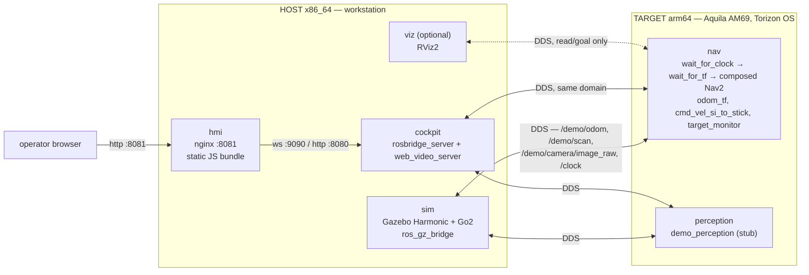

# HIL — Go2 in the maze (cockpit on the host, ROS on the Aquila AM69)

A lean guide for **a single configuration**: `hil` mode, Unitree Go2 quadruped
robot, `quadruped_maze11.sdf` scenario (the maze), web cockpit running on the
x86 host, Nav2 and perception running on the Aquila AM69. It does not cover
`learn`, `deploy`, the diff-drive robot, or the ML3.5 phases already closed.

For everything else — all modes, the phase history, the details of each trap
encountered — see "See also" at the end.

## 1. Architecture

Two machines, one DDS (CycloneDDS, `ROS_DOMAIN_ID=69`) connecting them over the
LAN. Nothing graphical crosses over to the Aquila: its GPU exposes only
OpenGL ES 3.2 and Vulkan, so Gazebo and RViz2 (both on OGRE 2) are pinned to the
host by definition.



| Role | Where it runs | Why |
| --- | --- | --- |
| `sim` (Gazebo + robot) | host, always | OGRE 2 requires desktop OpenGL |
| `viz` (RViz2) | host, optional/dev | same |
| `cockpit` (rosbridge + web_video_server) | host today | pure transport, no OGRE — could move to the module later |
| `hmi` (web bundle) | host today | same — nginx serving static files |
| `nav` (Nav2 without map/AMCL) | **Aquila AM69** | this is what ML3.5 delivers: navigation running on the real target |
| `perception` (stub) | **Aquila AM69** | the topic contract already runs on the target; swapping in TIDL will be a container swap |

The browser never talks to the Aquila directly. It talks to `hmi`/`cockpit` on
the host; what crosses the network to the module is DDS itself, behind the
scenes.

## 2. Technologies, libraries and frameworks

### Host (x86_64 / amd64)

| Layer | What |
| --- | --- |
| OS | Linux with an X11 session (Gazebo/RViz2 require `/tmp/.X11-unix` and `/dev/dri`) |
| Orchestration | Docker + Docker Compose v2, `docker/compose.host.yml` |
| ROS | ROS 2 Jazzy, `rmw_cyclonedds_cpp`, base image `ros:jazzy-ros-base` |
| Simulation | Gazebo Harmonic (`ros_gz_sim`, `ros_gz_bridge`), `ros2_control` + `ros2_controllers`, `imu_sensor_broadcaster` |
| Robot | `go2_description` (Unitree Go2 URDF/xacro/meshes, vendored from `unitreerobotics/unitree_ros`, BSD-3) |
| Gait control | `gz_quadruped_hardware` (Gazebo plugin, fork of `gz_ros2_control` v2.0.6) + `unitree_guide_controller` (`ros2_control` controller, kinematics/dynamics via KDL, port of `unitreerobotics/unitree_guide`) — based on `legubiao/quadruped_ros2_control`, Apache-2.0 |
| Visualization | RViz2 + `nav2_rviz_plugins` + `rqt_common_plugins` (`viz` container, optional) |
| Cockpit — transport | `rosbridge_suite` (WebSocket, protocol v2) + `web_video_server` (MJPEG) |
| Cockpit — interface | `hmi/`: HTML/CSS/ES modules **with no build step** (no npm, no bundler), its own rosbridge client (`js/ros/rosbridge-client.js`, does not use `roslibjs`), served by `nginx:alpine` |
| Operator tooling | Native Python 3 on the host: `scripts/maze_fit.py`, `maze_route.py`, `nav_trial.py`, `nav_campaign.py`, etc. |

### Target — Aquila AM69 (arm64, Torizon OS)

| Layer | What |
| --- | --- |
| OS | Torizon OS 7.7.0 (installed only via Toradex Easy Installer — never remote OTA up to this baseline) |
| Orchestration | Torizon's native Docker + Docker Compose, `docker/compose.module.yml` |
| ROS | ROS 2 Jazzy, `rmw_cyclonedds_cpp`, same base image as the host (arm64) |
| Navigation | Nav2 **composed** into a single `component_container_isolated` (fewer `/clock` subscribers, measured: from 470% down to 324% CPU): `bt_navigator`, `controller_server` (MPPI), `planner_server` (NavFn), `nav2_costmap_2d`, `collision_monitor`, `lifecycle_manager`, `route`, `smoother`, `velocity_smoother`, `waypoint_follower`, `opennav_docking` — no map, no AMCL, `nav2_params_go2.yaml` |
| Support nodes | `odom_tf` (closes `map→odom→base`), `cmd_vel_si_to_stick` (Nav2 speaks SI, the robot expects joystick input), `wait_for_clock` → `wait_for_tf` (Nav2's starting gate, avoids the race that aborts bringup), `target_monitor` (publishes CPU/memory/temperature and the commanded axes to the cockpit) |
| Perception | `demo_perception` — deterministic stub, `vision_msgs`, `image_transport` + `compressed_image_transport` |
| **Does not run here** | Gazebo, RViz2, anything on OGRE 2 — by construction, not by choice |

## 3. Scenario: the maze (`quadruped_maze11.sdf`)

This is the **official, default** world for the quadruped robot — no `SIM_ARGS`
is needed to select it. The maze mesh is an **external** dependency, not
versioned in this repository (its upstream `package.xml` declares
`<license>TODO</license>`):

```bash
git clone --depth 1 https://github.com/cafemesa/ros_maze_worlds.git ~/ros_maze_worlds
```

Clone it to a **stable** path, never under `/tmp` — a reboot in the middle of a
demo wipes the clone and the maze disappears with no error at all, only a
discreet Gazebo warning about an unresolved mesh.

## 4. Preparation and installation

### On the host

1. Docker + Docker Compose v2, GPU driver (Intel/AMD: `/dev/dri` is already
   enough; NVIDIA: `nvidia-container-toolkit` and swap `devices` for `gpus: all`
   on the `sim`/`viz` services).
2. Find the GPU group and note it down for the `.env`:
   ```bash
   getent group render | cut -d: -f3
   ```
3. Clone the maze (step 3 above).
4. Configure:
   ```bash
   cp docker/.env.example docker/.env
   ```
   Fill in at least: `MODULE_HOST` (or `MODULE_IP`), `HOST_IP`,
   `ROS_DOMAIN_ID` (default 69), `RENDER_GID` (from step 2), `MAZE_MODELS`
   (path of the clone). `ROBOT_TYPE` is already `quadruped` by default.
5. Authorize the containers to open an X11 window:
   ```bash
   xhost +local:docker
   ```

### On the Aquila AM69

1. Torizon OS 7.7.0 installed via **Toradex Easy Installer** — it is the only
   supported path up to this baseline; a V1.0 module with an old bootloader
   that loads the V1.1 device tree stops booting.
2. Docker ships with Torizon. No manual installation of ROS packages: everything
   arrives as a container image.
3. SSH access from the host to the module (user `torizon`), on the same LAN.

After that, the module-side preparation is done **from the host**, through
`scripts/module.sh` (next section) — nothing is edited manually on the Aquila.

## 5. How to run

### 5.1 First time (or after changing `ros2_ws/src`)

```bash
scripts/module.sh sync    # sends sources + arm64 Dockerfiles + compose.module.yml,
                           # renders the DDS peer configuration on both sides
scripts/module.sh build   # native arm64 build ON the module (minutes; QEMU would take hours)
```

`sync` also writes the module's `.env` and the rendered CycloneDDS config
(`docker/cyclonedds/host.rendered.xml` on the host, `module.xml` on the module) —
without it neither side's `RMW` knows the other's address.

### 5.2 Bring up the Aquila (nav + perception)

```bash
scripts/module.sh up       # docker compose -f compose.module.yml up -d --force-recreate
scripts/module.sh verify   # 4 stages: UDP reachability, module sees host, host receives from module,
                            # Nav2 actually ACTIVE (not merely a "running container")
```

### 5.3 Bring up the host (Gazebo + cockpit)

Build and bring-up are **two steps**, not a single `up --build`. The host's
default builder is `armbuilder` (`docker-container` driver), and it cannot see
Docker's local image store — `sim`, `cockpit` and `hmi` do
`FROM local/demo-aquila-base:dev`, and without step 1 below resolving that
`FROM` tries to pull the tag from the registry and fails with
`pull access denied for local/demo-aquila-base` (observed even when including
`base` in the same `up --build`: bake builds the targets in parallel and does
not create an image dependency between separate Dockerfiles — only Compose's
`service_completed_successfully`, which orders container *start*, not the
build):

```bash
# 1. build the base first, by itself — leaves the image in the local image store
docker compose -f docker/compose.host.yml build base

# 2. build the rest with the default builder — only it can see the newly built image
BUILDX_BUILDER=default docker compose -f docker/compose.host.yml build sim cockpit hmi

# 3. bring the services up (without --build: the images already exist)
docker compose -f docker/compose.host.yml up -d sim cockpit hmi

# optional, for visual debugging:
docker compose -f docker/compose.host.yml up -d viz
```

Do not change the default builder globally — `armbuilder` is what serves the
module's arm64 multi-arch builds (section 6 of the full guide).

Before bringing things up, check that no old stack is still holding the port:
since the default Compose project name is the directory name, an earlier
invocation with a different `-p` (or from another clone/worktree) leaves
containers `Up` under another prefix, competing for the `hmi`'s `:8081` and for
the same `ROS_DOMAIN_ID` as `sim`/`cockpit` without warning:

```bash
docker ps -a --format '{{.Names}}\t{{.Status}}' | grep -v "^docker-"
```

If anything shows up, it is another Compose project with the same services
alive — tear it down with
`docker compose -p <nome-do-projeto> -f docker/compose.host.yml down`
before continuing.

No `SIM_ARGS` is needed — `quadruped_maze11.sdf` is the default. Without
`MAZE_MODELS` pointing at the maze clone (step 3 of section 3), the launch
**aborts** with a `RuntimeError` naming the missing model — it is no longer a
silent warning. That is deliberate: before this, Gazebo would bring up an empty
plane without flagging anything, and a navigation trial on it would finish
`SUCCEEDED` faster than reality (`quadruped.launch.py:_check_external_models`).

### 5.4 Open the cockpit

```
http://localhost:8081
```
(or `http://<ip-do-host>:8081` from another machine on the same LAN).

### 5.5 Shut down

```bash
docker compose -f docker/compose.host.yml down
scripts/module.sh down
```

## 6. Execution scripts

| Script | Runs on | Role |
| --- | --- | --- |
| `scripts/module.sh` | host (orchestrates the Aquila over SSH) | `inventory`, `sync`, `build`, `up`, `down`, `status`, `verify`, `shell` |
| `scripts/env.sh` | host, native (outside a container) | ROS environment variables for running tools outside Compose |
| `scripts/maze_fit.py` | host, offline, no ROS | confirms the maze fits the robot, suggests the spawn pose |
| `scripts/maze_route.py` | host, offline, no ROS | derives the maze exit route (waypoints for `patrol_commander`) |
| `scripts/nav_campaign.py`, `nav_trial.py` | host | navigation trials/campaigns against the module's Nav2 |
| `hmi/` (no script of its own) | host, served by `nginx` in the `hmi` container | the operator interface |

`scripts/run_quadruped_sim.sh` and `scripts/run_cockpit.sh` also exist in the
repository, but **are not part of this path**: the first still references a
throwaway image from the F2 spike (`demo-sim:spike-go2`, never committed), and
the second orchestrates a standalone PyQt5/X11 cockpit that
`docs/results/cockpit-standalone-parcial.md` marks as **superseded** by the web
cockpit. Both are candidates for cleanup, not for use.

## 7. Quick verification

```bash
# on the host, after 5.2 and 5.3
ros2 topic list                       # native, requires `source scripts/env.sh` first
ros2 topic hz /demo/odom
scripts/module.sh status              # module containers + configured DDS peers
```

The most common symptom of incomplete configuration: `ros2 topic list` comes
back empty or half-populated. Check in this order — `ROS_DOMAIN_ID` equal on
both sides, `MODULE_IP`/`HOST_IP` correct in `docker/.env`,
`scripts/module.sh sync` run after the last network change — before suspecting
the firewall.

## 8. See also

- [`docs/guia-completo.md`](guia-completo.md) — full operations guide, the three
  modes (`learn`/`hil`/`deploy`), known traps and the cockpit in detail.
- [`docs/ml35/guia-ml35-docker.md`](ml35/guia-ml35-docker.md) — implementation
  specification for the containerization (why each image exists the way it
  does).
- [`docs/ml35/estado-fases.md`](ml35/estado-fases.md) — authoritative per-phase
  state; read it before assuming anything is already closed.
- [`docs/ml35/plano-cockpit-web.md`](ml35/plano-cockpit-web.md) — plan and
  decisions for the web cockpit, including why the PyQt5 path was abandoned.
