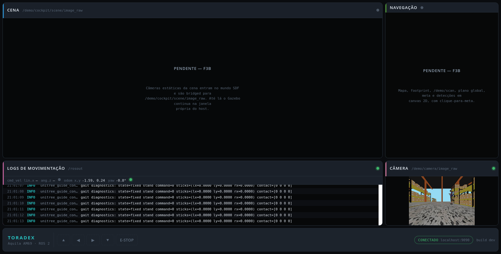
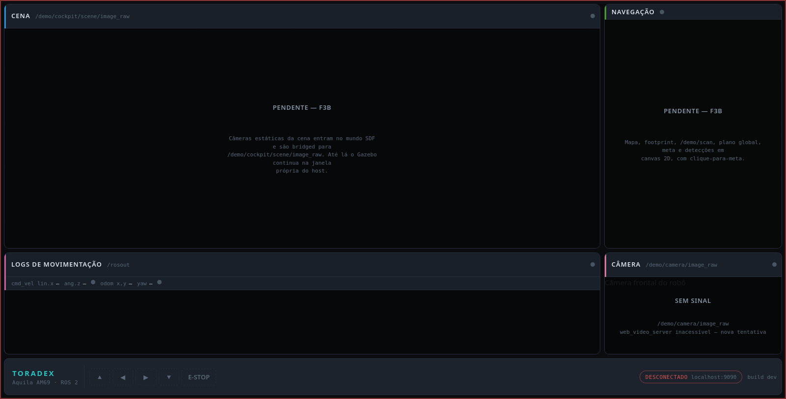

# Cockpit web — F1: esqueleto e transporte

**Executado em hardware real:** não. Tudo abaixo é a workstation x86 em modo
learn. Nada aqui autoriza afirmação sobre o Aquila AM69 (regra 7 do CLAUDE.md).

| | |
| --- | --- |
| Data | 2026-08-24, 20:55–21:01 UTC |
| Máquina | workstation x86_64, Ubuntu 24.04, kernel 7.0.0-30-generic |
| Revisão git | `a0d21d3` + a árvore de trabalho deste F1 |
| Docker / Compose | 29.7.2 / 5.0.2 |
| Imagem cockpit | `local/demo-aquila-cockpit:dev` `sha256:c9ed73ed4045` |
| Imagem hmi | `local/demo-aquila-hmi:dev` `sha256:c8663df7d3e3` |
| Pacotes | `ros-jazzy-rosbridge-suite` 2.7.0, `ros-jazzy-web-video-server` 3.1.0 |
| Topologia | tudo numa máquina; DDS local (`host.xml`, peer 127.0.0.1) |
| Plano | `docs/ml35/plano-cockpit-web.md` §6, fase F1 |

## Como reproduzir

```bash
docker compose -f docker/compose.host.yml build base cockpit hmi
SIM_GUI=false docker compose -f docker/compose.host.yml up -d sim cockpit hmi
xdg-open http://localhost:8081
```

Testes do bundle: `cd hmi && npm test`
Guardas estruturais: `python3 -m pytest tests/ -q`

## Portão do F1

> As cinco regiões aparecem na proporção da imagem; o painel de câmera mostra
> `/demo/camera/image_raw` ao vivo; derrubar o rosbridge muda o estado visual
> para "desconectado" e ele reconecta sozinho.

**Atendido.** Evidência abaixo.

### 1. Cinco regiões, câmera ao vivo



Captura de tela real do bundle servido pelo nginx, feita via WebDriver
(geckodriver + Firefox headless, 1600x900) com a simulação rodando. O painel
CÂMERA mostra a vista frontal do Go2 dentro do `warehouse.sdf`. Os painéis CENA
e NAVEGAÇÃO estão hachurados e rotulados "PENDENTE — F3B", que é o estado
correto nesta fase.

Taxa medida da fonte, no container `cockpit`:

```
$ ros2 topic hz /demo/camera/image_raw
average rate: 9.984   min: 0.094s  max: 0.104s  std dev: 0.00237s
```

### 2. Estado desconectado



Com `docker compose stop cockpit`: moldura vermelha em todo o cockpit, badge
`DESCONECTADO`, todos os dots de frescor em cinza, e o painel de câmera com
`SEM SINAL / web_video_server inacessível — nova tentativa`.

### 3. Reconexão automática

Exercitada contra um `docker compose restart cockpit` real, dirigindo o **mesmo
módulo** que o navegador usa (`hmi/js/ros/rosbridge-client.js`) sob Node:

```
  0.0s state -> disconnected | odom freshness = never
  0.0s state -> connecting
  0.0s state -> connected
  3.0s >>> restarting the cockpit container
 14.1s state -> disconnected
 14.3s state -> connecting
 14.3s state -> disconnected
 14.8s state -> connecting
 14.8s state -> disconnected
 15.8s state -> connecting
 15.8s state -> connected
 40.0s odom before drop = 142 | after recovery = 1676
RECONNECT PASS
```

Os intervalos entre tentativas (250 ms, 500 ms, 1000 ms) são o backoff de
`RETRY_DELAYS_MS`. As 1676 mensagens depois da recuperação provam que o replay
de assinaturas funcionou: rosbridge não guarda estado entre conexões, e sem o
replay a badge voltaria a verde sem nunca mais entregar mensagem.

### 4. Smoke do transporte

O cliente real contra o rosbridge real, 6 s:

```
  rosout from rosbridge_websocket -> Calling services in new thread
  odom x = -1.594
  camera_info 640x480
  counts { odom: 282, rosout: 22, camera_info: 30 }
  camera freshness = live
  rosapi sees 7 demo topics
SMOKE PASS
```

`camera_info: 30` em 6 s = 5 Hz, que é o `throttle_rate: 200` pedido pelo painel
sobre um tópico de 10 Hz — a limitação de taxa do rosbridge está ativa.

## Testes automatizados

```
$ node --test "hmi/test/**/*.test.js"
ℹ tests 52   ℹ pass 52   ℹ fail 0

$ python3 -m pytest tests/ -q
12 passed
```

## Pontos abertos do plano que esta execução resolveu

### 1. `rosbridge_suite` 2.x expõe ações ROS 2? — **Sim.**

O log de startup do `rosbridge_websocket` 2.7.0 registra as capacidades:

```
 - <class 'rosbridge_library.capabilities.advertise_action.AdvertiseAction'>
 - <class 'rosbridge_library.capabilities.action_feedback.ActionFeedback'>
 - <class 'rosbridge_library.capabilities.action_result.ActionResult'>
 - <class 'rosbridge_library.capabilities.send_action_goal.SendActionGoal'>
```

Consequência para o F4: o relay `/goal_pose` → `NavigateToPose` em `demo_hmi`
pode ficar menor, ou ser dispensado, já que o navegador pode mandar a meta
direto por `send_action_goal`. Decidir no F4, **medindo**, não por leitura de
log: registrar capacidade não é o mesmo que entregar feedback de uma meta longa.

### 3. `web_video_server` aceita o `/demo/camera/image_raw` reliable? — **Sim,
sem reconfiguração.**

O tópico é publicado com QoS reliable de propósito
(`bridge_quadruped.yaml`). O assinante best-effort do `web_video_server` é
compatível com um publicador reliable, e o stream flui: 6,4 MB em 6 s, e o
`/snapshot` devolve um JPEG 640x480 de 106 kB.

## Armadilha encontrada, e que custa uma tarde

`web_video_server` **não faz percent-decode do parâmetro `topic`**. As duas
formas respondem HTTP 200:

```
topic=%2Fdemo%2Fcamera%2Fimage_raw   ->  200, 22 bytes, nenhum quadro
topic=/demo/camera/image_raw         ->  200, MJPEG flui
```

`URLSearchParams` escapa `/` por padrão, então a primeira versão do painel
mostrava um retângulo vazio com status 200 e nada em log nenhum. Corrigido em
`hmi/js/config.js` (`encodeTopicParam`) e travado por teste.

Segunda armadilha, medida no mesmo dia: no Firefox um `` ligado a
`multipart/x-mixed-replace` **nunca dispara `load`** e mantém
`complete === false` durante toda a vida de um stream saudável. Um painel que
confiasse nesse evento declararia "sem sinal" sobre vídeo ao vivo — foi o que
aconteceu antes da correção. Por isso o frescor da câmera vem de
`/demo/camera/camera_info` pelo rosbridge, e não do ``.

## O que NÃO foi verificado

- Nada em arm64 ou no Aquila AM69. As imagens `cockpit` e `hmi` são
  multi-arch por construção (`ros:jazzy-ros-base` e `nginx:alpine` publicam as
  duas arquiteturas), mas **só foram construídas para amd64** aqui.
- Nenhum número de FPS, latência ou CPU do módulo. O F6 do plano é quem coleta
  isso, e só vale medido no hardware.
- Aceleração de GPU do Chromium: fora de escopo (M3).
- Chromium: o bundle foi verificado no Firefox. A armadilha do cache no ``
  citada em `config.js` vem da literatura, não de medição nesta sessão.

## Configuração local alterada nesta sessão

`docker/cyclonedds/host.rendered.xml` fixava `enp0s31f6`, que está **DOWN**
nesta máquina (é a Ethernet da bancada, ainda sem enlace). Com a interface
ausente o CycloneDDS falha na criação do participante e todo nó morre com

```
rclpy._rclpy_pybind11.RCLError: error creating node: error not set, at ./src/rcl/node.c:252
```

que não nomeia DDS em lugar nenhum. Para o modo learn o arquivo foi
regenerado a partir do `host.xml` commitado (`autodetermine` + peer 127.0.0.1).
O arquivo é gitignored. Para voltar ao HIL: `scripts/module.sh sync`, ou
restaurar de `log/host.rendered.hil.xml.bak`.
