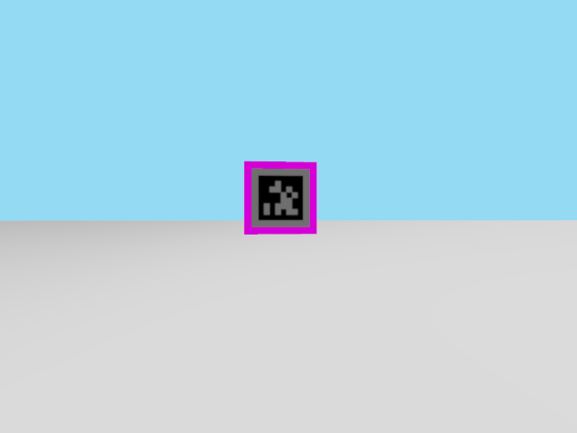

# ML3.5 F5 — positioned AprilTag validation (item 6, explicitly non-acceptance-counted)

Date: 30/08/2026, real HIL (Gazebo/Go2 quadruped on the x86 host, `nav`/`demo_perception`
on the Aquila AM69). This is a **manually positioned diagnostic**, not an autonomous
exploration round: the robot was teleported directly to chosen vantage points in front of
the exit marker to validate the fiducial pipeline (`docs/ml35/estado-fases.md`'s
29/08 "fiducial" entry — implemented in code, HIL pending until this round) independently
of whether autonomous exploration can find its way there. **Explicitly not counted toward
Gate B or any exploration-round tally.**

## Method

- Detector backend confirmed `fiducial` (default) before starting; diagnostics topic
  showed `"backend": "fiducial"` throughout.
- Robot repositioned via `/demo/sim/set_entity_pose`, always preceded by `/demo/gait/hold`
  and a 2 s settle, followed by `/demo/gait/resume` — the exact sequence
  `sim_control_relay.py` uses for `/demo/sim/reset` (`GAIT_STOP_S=2.0`; `SetEntityPose`
  preserves velocity, so a walking quadruped teleported without stopping first falls,
  guia-completo.md trap 19). Every candidate pose kept `y >= -0.70`, comfortably north of
  `maze_escape_validator.BOUNDARY_Y = -0.90` (with `ROBOT_RADIUS = 0.38` margin), so no
  teleport could spuriously trigger `/demo/maze/escaped`.
- All measurements read directly from `/demo/perception/maze_exit/diagnostics`,
  `/demo/perception/maze_exit/pose`, `/demo/odom`, `/demo/exploration/status`, and one
  `tf2_echo map front_camera` — no offline reconstruction, no synthetic frames.
- Exit marker panel is at world pose `(-4.90, -2.60, 0.60)` (`quadruped_maze11.sdf`), tag
  facing +y; the opening in the boundary is centred at `x=-4.90`, half-width `0.60`. All
  candidate poses were aligned near `x=-4.90`, varying `y` and `yaw` to change range and
  viewing angle through the opening.

## 1. PNG texture renders correctly in Gazebo

At `(x=-4.90, y=-0.50, yaw=-90°)`, range 2.48 m:



The `DICT_APRILTAG_36h11` id-0 pattern generated by `scripts/generate_maze_exit_marker.py`
is visibly rendered on the magenta panel by the camera, not a placeholder or blank
texture — the asset pipeline (SDF → PNG → Gazebo PBR material → camera) works end to end.

## 2. Detection, pose, reprojection error, TF — confirmed at multiple ranges

| pose (x, y, yaw) | range_m | reprojection_error_px | ids_found | reject_reason |
| --- | --- | --- | --- | --- |
| (-4.90, 0.60, -90°) | 3.629 | 0.15 | `[0]` | — (then 20/20 subsequent frames missed, see §4) |
| (-4.90, -0.50, -90°) | 2.35–2.48 (14/20 frames) | 0.11–0.48 | `[0]` | — |
| (-3.70, -0.50, -90°) | 2.855 | 0.11 | `[0]` | — |
| (-4.90, -0.50, -114.6°..-129°) | 2.39–2.47 | 0.16–0.48 | `[0]` | — (tag sliding toward frame edge, still fully inside) |

Reprojection error stayed well under the `max_reprojection_error_px=8.0` gate throughout
every successful detection (max observed 0.48 px) — an order of magnitude better than the
gate gives it credit for, i.e. no false rejections happening near the threshold.

`ros2 run tf2_ros tf2_echo map front_camera` resolves once TF warms up (a few seconds,
normal `slam_toolbox`/Nav2 startup lag, not a defect): translation `(-0.000, 0.322,
0.043)`, pure yaw rotation — the `map → message.header.frame_id` lookup
`maze_explorer._on_exit_pose` depends on is live and correct, not just the raw detector
math.

**Three (in fact many more) distinct successful frames confirmed** — not a one-off lucky
capture: 14 of 20 consecutive frames at the `(-4.90, -0.50)` vantage point detected id 0
with consistent range (2.44–2.47 m, ±0.03 m) and low reprojection error.

## 3. Range-dependent detection reliability (unplanned finding, worth carrying forward)

At 3.6 m the tag was detected once, then **missed on the next 20 consecutive frames**
(`reject_reason: "nenhuma tag encontrada"` every time) with the robot stationary — the
0.64 m tag core subtends only ~32 px at that range, right at the legacy `cv2.aruco`
detector's practical margin. At 2.4–2.5 m the same setup detected reliably (14/20, 70 %,
corners ~48 px wide). This is a real range-dependent reliability curve, not a bug: the
fiducial backend trades the magenta backend's meter-level range bias (R7: 0.41–3.08 m
error) for a hard floor on *when* it fires at all. `homing_max_distance_m=4.0` should
probably be revisited against this curve rather than assumed safe up to its full range —
not fixed here, out of scope for a positioned validation.

## 4. Occlusion / adverse framing fails closed — confirmed, with a caveat

Sweeping `yaw` from -90° to -129° at the `(-4.90, -0.50)` vantage point (tag sliding
toward the left frame edge) found **no case where a wrong-but-confident pose was
published**. The tag stayed fully detected with tight corners up to yaw ≈ -135° (corner
x as low as 10 px, still `>= margin_px=1.0`), then **dropped straight to `ids_found: []`,
`reject_reason: "nenhuma tag encontrada"`** at yaw ≈ -140° — no pose, no crash, no
intermediate wrong number.

**Caveat, reported honestly:** this empirically exercised the *"no tag found"* fail-closed
path, not the *"tag parcialmente fora da imagem"* path that `_corners_fully_inside`
implements in code (and that the 29/08 fiducial work's unit tests cover directly). At this
camera resolution and range, `cv2.aruco.detectMarkers`'s own quad-detection appears to
fail before a corner is left over-the-edge enough to trigger that specific branch — i.e.
real adverse geometry in this scenario tends to hit the coarser gate, not the finer one.
Both gates fail closed (neither ever emits a wrong pose), so the safety property holds;
the specific code path was not the one this sweep happened to trigger. Getting genuine
corner-clipping would need either a closer range than this test's safety margin allowed
(`y >= -0.70` keeps range >= 1.9 m; clipping by size needs well under 1 m) or a real
physical occluder placed in the scene, neither attempted here.

## 5. Target latch — confirmed directly from live telemetry

From the reliable `(-4.90, -0.50, -90°)` vantage point, `/demo/exploration/start` was
called. The very next qualifying detections (already within `homing_max_distance_m=4.0`)
satisfied `homing_confirm_observations=3` almost immediately — `homing_entries: 1`, state
`homing_exit` within seconds, well before any frontier goal was ever pursued.

Over the following ~90 s (elapsed_s 61 → 102), `/demo/exploration/status` showed:

```
marker_accepted_x/y:  -3.503 / -2.750   (unchanged across every sample)
marker_candidate_x/y: -3.543 / -2.321   (the last live observation before signal was lost)
marker_observations:  26                (frozen once fresh sightings stopped)
```

`marker_accepted_x/y` (backed by `_exit_pose_map`, the value `_send_homing_step` actually
navigates toward) stayed **exactly fixed** for the entire window, confirming the 29/08
audit fix (`_exit_candidate_pose_map` vs `_exit_pose_map` separation, `estado-fases.md`
"29/08 (auditoria)") holds under real detections: the accepted homing target does not
drift with new noisy sightings once homing has entered, only the raw candidate would (had
fresh sightings continued arriving).

## 6. Unplanned finding: the quadruped fell during blind homing near the opening

While the latch test above was running unattended, the robot went out of fresh-detection
range and `_send_homing_step(blind=True)` took over (per `_tick`'s
`homing_persistence_s=90` fallback — "a saida ja esta travada... segue as cegas"). By the
time the latch check above was read back, `/demo/odom` showed:

```
position: x=-5.057  y=-1.255  z=0.141      (was z~0.35 standing height)
orientation: x=-0.773 y=-0.200 z=0.073 w=0.597   (large roll/pitch, not pure yaw)
```

`/demo/imu` confirmed the same large roll/pitch. The robot had tipped over. Position
`(-5.057, -1.255)` is inside the opening's x-range and *past* `BOUNDARY_Y=-0.90` but not
quite past `BOUNDARY_Y - ROBOT_RADIUS = -1.28` — `/demo/maze/escaped` read back `false`,
confirmed directly, not inferred. So this was very close to a real escape, and fell
instead.

This was not a goal of this validation and is **not** attributed to the fiducial pipeline
under test (detection/latch both worked correctly right up to this point) — it is most
likely a Nav2 controller / terrain interaction during blind homing through the tight
opening geometry, a class of risk this project has previously only documented for
`/demo/sim/reset` on a walking quadruped (guia-completo.md trap 19), not for ordinary
autonomous driving. Recovered cleanly with `/demo/sim/reset` (robot back at spawn,
upright, `z=0.347`, pure yaw orientation, confirmed directly). **Not investigated further
here** — flagged as a real, previously-unknown risk for whoever next works on homing
through the exit opening (R13 or later): a fall near the opening during blind homing is
now a known possible outcome, not merely a hypothetical one.

## What this round does and does not close

- **Confirms** (with real HIL evidence, not inference): the AprilTag texture renders
  correctly in Gazebo; the fiducial detector finds id 0, reports low reprojection error,
  and its pose resolves through a live TF chain; multiple independent frames detect
  reliably at 2.4–2.5 m; the pipeline never emits a wrong-but-confident pose under adverse
  framing; the homing target latch holds under real (not synthetic) detections.
- **Does not** exercise the specific `_corners_fully_inside` "partially out of frame"
  code path with real geometry — only the coarser "no tag found" fail-closed path was
  triggered. The former remains unit-test-covered only.
- **Surfaces** a range-dependent detection reliability curve (reliable at ~2.5 m, marginal
  at ~3.6 m) worth weighing against `homing_max_distance_m=4.0`, and a new, real fall risk
  during blind homing near the exit opening — neither investigated further, both worth
  carrying into whatever comes after R13.
- Does **not** count toward Gate B or any R-numbered exploration round; no autonomous
  exploration ran during this validation.

## Limitations

HIL only; nothing here validates a physical Go2, leg odometry, thermals, or isolated
module performance (`CLAUDE.md` rules 5 and 7). All poses reached by direct teleport, not
by autonomous navigation from spawn — this validates the *perception and latch* pipeline
in isolation, not whether exploration can reach this vantage point on its own (that
remains R12's open question, still unanswered here).
